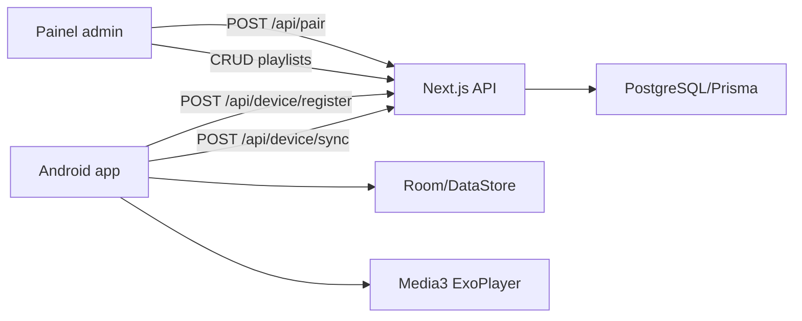

# Arquitetura

## Fluxo principal

## Android

- `DataStore` guarda `deviceId`, token, MAC virtual, código e URL do painel.
- `Room` guarda canais, favoritos e histórico com índices para listas grandes.
- Parsers rodam em `Dispatchers.IO`.
- UI usa Compose com cards grandes, foco visível e tema escuro.
- Player usa Media3 ExoPlayer com `LoadControl` configurável por modo de buffer.

## Web/API

- Next.js App Router com API routes.
- Prisma conversa com PostgreSQL.
- Admin usa cookie HTTP-only assinado.
- Dispositivo usa `deviceId` + token.
- Pairing code é salvo como hash HMAC e expira em 15 minutos.
- Credenciais de playlist são criptografadas com AES-256-GCM.

## Isolamento

`/api/device/sync`, `/api/app/favorites` e `/api/app/history` validam o token do dispositivo e filtram dados pelo registro interno do device. A API não retorna playlists de outros dispositivos.
